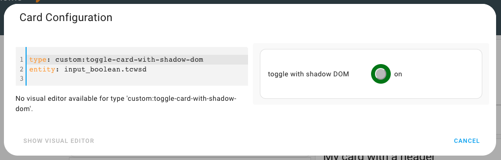

# Plain Vanilla JavaScript Toggle Card With Shadow DOM


Encapsulate CSS into a shadow DOM

***

* @published: May 2023
* @author: Elmar Hinz
* @workspace: `conf/www/tutor`
* @name: `toggle-card-with-shadow-dom`
* @id: `tcwsd`

You learn:

* how to encapsulate the CSS into a shadow dom
* how to reduce BEM to EM methodology
* how to handle repeated calls of setConfig in the configuration editor

## Goal

In this tutorial you will learn how to use a shadow DOM to encapsulate
the CSS to the card. You can drop the prefixes. The BEM methodology
(block, element, modifier) gets shrunk to EM methodology.

## Prerequisites

* tutorial 04: Plain Vanilla JavaScript Toggle Card
* you know how to register the `card.js` as a resource
* you know how to create the helper entity of type `boolean` aka `toggle`
* you know how to add and edit a card
* you know how to reload `card.js` after editing

## Setup

Take the same steps as in the previous tutorial. Name the helper entity
`tcwsd` this time.



## The code

The code is slightly modified. A function `doShadowDom()` is added to the
workflow. Here the shadow dom is created. The *style* and the *cards* HTML
are added.

```js
    doShadowDom() {
        if (!this.shadowRoot) {
            this.attachShadow({ mode: "open" });
        }
        this.shadowRoot.replaceChildren(this.status.style, this.status.card);
    }
```

The function `doSetup()` has been renamed to `doCard()`. The prefixes
of the HTML classes and in the style have been removed.

```js
    doCard() {
        this.status.card = document.createElement("ha-card");
        if (this.getHeader()) {
            this.status.card.setAttribute("header", this.getHeader());
        }
        this.status.card.innerHTML = `
                <div class="card-content">
                    <p class="error error--hidden">
                    <dl class="dl">
                        <dt class="dt"></dt>
                        <dd class="dd">
                            <span class="toggle">
                                <span class="button"></span>
                            </span>
                            <span class="value">
                            </span>
                        </dd>
                    </dl>
                </div>
        `;
        this.status.error = this.status.card.querySelector(".error")
        this.status.dl = this.status.card.querySelector(".dl")
        this.status.topic = this.status.card.querySelector(".dt")
        this.status.toggle = this.status.card.querySelector(".toggle")
        this.status.value = this.status.card.querySelector(".value")
    }
```

```js
    doStyle() {
        this.status.style = document.createElement("style");
        this.status.style.textContent = `
            .error {
                text-color: red;
            }
            .error--hidden {
                display: none;
            }
            .dl {
                display: grid;
                grid-template-columns: repeat(2, minmax(0, 1fr));
            }
            [ ... ]
        `
    }
```

Without the need to use prefixes the CSS becomes much more readable.
Also the log entries of the lifecycle have been removed. They served
the purposes of the previous tutorial.

### Addressing the configuration editor

So far the concept is to do the big setup of *HTML* and *CSS* once triggered by `setConfig()`,
then to do small changes of the dynamic values triggered by `set hass()`. Unfortunately this
doesn't work the same way inside the configuration editor. Here `setConfig()` is called
repeatedly upon each edit of the form.

We need to adopt our concept to this. It isn't a big issue if *HTML* and *CSS* are
created repeatedly during the rare moment of form editing. We can hold to this. But
we have to write `doShadowDom()` in a way, that it can deal with this repetition.

```js
    doShadowDom() {
        if (!this.shadowRoot) {
            this.attachShadow({ mode: "open" });
        }
        this.shadowRoot.replaceChildren(this.status.style, this.status.card);
    }
```

Therefore we need to check if `this.shadowRoot` is already existing before attaching it.
We also use `element.replaceChildren()` instead of `element.append()` to update
the children instead of just adding them.

The configuration editor does call `setConfig()` repeatedly but it doesn't call
`hass()` thereafter. As we have fully replaced the *HTML* we need to trigger `doUpdate()`
somehow to set the dynamic values again. We do this by checking if the *hass object* is already
existing when `setConfig()` is called. In this case it is not called from the
dashboard but repeatedly in the configuration editor.


```js
    setConfig(config) {
        this.status.config = config;
        this.doCheck();
        this.doCard();
        this.doStyle();
        this.doShadowDom();
        this.doListen();
        // Although doCard(), doStyle(), doShadowDom()
        // are designed to be called once in the
        // dashboard this doesn't hold for the
        // configuration editor. The editor does
        // call setConfig() repeatedly without
        // calling hass() thereafter.
        // In this case HTML/CSS are redrawn
        // and need an update to refill the values.
        if (this.hasHass()) {
            this.doUpdate();
        }
    }
```

## Discussion

The solution feels a little ugly, too much workarounds. Looking for a more clean solution we would
need to split the workflow into three steps:

1. initial setup of *HTML* and *CSS*
2. updates triggered by `setConfig()`
3. updates triggered by `set hass()`

The first step basically belongs into the constructor, which is really called once.
The current method `doCard()` wouldn't work in the constructor though. The method
`querySelector()` would not work in this early state.